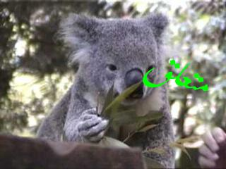
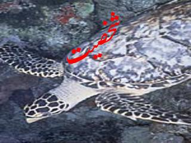
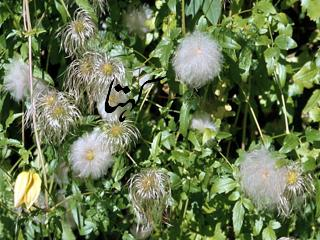
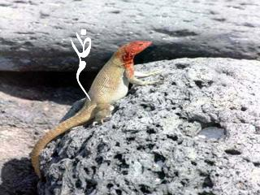
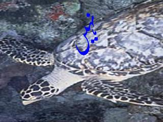

# SyntheticUrduDataset
<b>Synthetic Urdu Dataset for Outdoor Text Detection and Recognition</b>

  
 
 

  

Initially in our research-paper-experiments, five-set of datasets, containing 4.2K and 51K Urdu-text-embedded synthetic images were generated using the CLE annotation text to evaluate different tasks of detection, orientation prediction, and recognition of ligatures. Those synthetic images contained 132, and 1600 unique ligatures corresponding to 4.2K and 51K images respectively, with 32 variations of each ligature (4-backgrounds and font 8-color variations). 
. 
. 
. 
--->>> The <b>Given dataset</b> here is <b>most similar to dataset</b> we used in our exmperiments/research with minor differences. The images with its filenames contain annotation in terms of Urdu-text localization coordinates, orientation angle and Ligature-name in Urdu text. <b>So, from  given annotation information, sub-datasets for given tasks</b> like <b>Urdu-Text-detection, Urdu-Text-orientation-prediction</b> and <b>Urdu-Text-ligature-recognition can be easily infered/constructed</b> and consequently used for training different machine learning algorithms.
. 
. 
--->>> <b>Real-world Urdu</b> outdoor-text dataset <b>"UrText"</b> will be shared soon ...

 
! 
! 
! 
! 
! 
Please cite our dataset as!!
 
<b>
Syed Yasser Arafat, and Muhmmad Javed Iqbal. "Urdu-Text Detection and Recognition in Natural Scene Images Using Deep Learning." IEEE Access (2020).
</b>
 
 
 
 

  
 for any queries: <b > [Syed Yasser Arafat]: <syed.yasser.arafat@gmail.com> </b> 

syed.yasser.arafat@gmail.com
